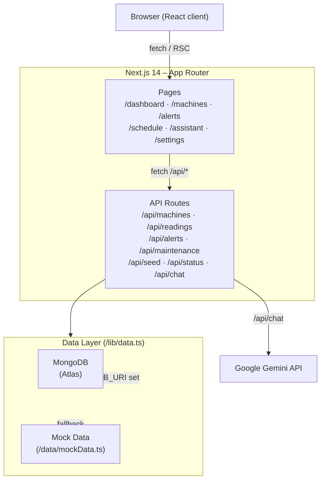

# PredictIQ

> **AI-powered predictive maintenance dashboard for industrial equipment.**

PredictIQ monitors industrial machines in real time, predicts failures before they happen using sensor-trend analysis, surfaces actionable alerts, and lets maintenance teams converse with an AI assistant powered by Google Gemini.

---

## Features

| Feature | Description |
|---|---|
| **Live sensor simulation** | Dashboard and machine-detail pages update every 5 s, writing new readings to MongoDB when connected |
| **Failure prediction** | Rule-based scoring engine weighing sensor values, trends, health score, and maintenance age |
| **Alert management** | Filterable alert list with one-click resolve |
| **Maintenance schedule** | Per-machine task list with status tracking |
| **AI Assistant** | Gemini-backed chat with live machine context injected into every prompt; falls back to a rule-based answer when the key is absent |
| **MongoDB integration** | Full CRUD API routes; falls back to mock data when no URI is set |
| **Live DB / Demo Data badge** | Top-bar badge shows which source the app is reading from |
| **Seed tool** | Settings page seeds mock data into MongoDB with a single click |

---

## Tech Stack

| Layer | Technology |
|---|---|
| Framework | Next.js 14 (App Router) |
| Language | TypeScript |
| Styling | Tailwind CSS |
| Charts | Recharts |
| Database | MongoDB (official driver) |
| Validation | Zod |
| AI | Google Gemini (`gemini-2.0-flash`) |
| Icons | Lucide React |
| Theme | next-themes |

---

## Architecture



### Layer explanation

| Layer | Responsibility |
|---|---|
| **Browser (client components)** | Renders UI, runs the 5-second sensor simulation timer, calls API routes for reads and writes |
| **Next.js pages** | Server or client components; no direct DB access – they call API routes |
| **API routes** | Thin controllers: validate input with Zod, delegate to `/lib/data.ts`, return JSON |
| **`/lib/data.ts`** | Tries MongoDB first; returns mock data on any error or missing URI |
| **`/lib/mongodb.ts`** | Cached `MongoClient` – one connection per serverless container (Vercel-safe) |
| **Gemini API** | `/api/chat` builds a machine-context summary, streams a response back to the client; `/lib/ai.ts` contains the helper and rule-based fallback |

---

## Folder Structure

```
predictiq/
├── src/
│   ├── app/
│   │   ├── api/
│   │   │   ├── chat/route.ts        # Gemini streaming chat
│   │   │   ├── machines/route.ts    # CRUD – machines
│   │   │   ├── readings/route.ts    # CRUD – sensor readings
│   │   │   ├── alerts/route.ts      # CRUD – alerts
│   │   │   ├── maintenance/route.ts # CRUD – maintenance tasks
│   │   │   ├── seed/route.ts        # Seed mock data into MongoDB
│   │   │   └── status/route.ts      # Returns "live" | "demo"
│   │   ├── dashboard/page.tsx
│   │   ├── machines/
│   │   │   ├── page.tsx
│   │   │   └── [id]/page.tsx
│   │   ├── alerts/page.tsx
│   │   ├── schedule/page.tsx
│   │   ├── assistant/page.tsx
│   │   └── settings/page.tsx        # Seed button + env info
│   ├── components/
│   │   ├── AppShell.tsx
│   │   ├── Sidebar.tsx
│   │   ├── TopBar.tsx               # Live DB / Demo Data badge
│   │   ├── MachineCard.tsx
│   │   ├── SensorChart.tsx
│   │   ├── HealthGauge.tsx
│   │   ├── AlertItem.tsx
│   │   ├── StatusBadge.tsx
│   │   └── ThemeProvider.tsx
│   ├── data/
│   │   └── mockData.ts              # Always present – source of truth for seed
│   └── lib/
│       ├── mongodb.ts               # Cached MongoClient
│       ├── data.ts                  # MongoDB-first data layer with mock fallback
│       ├── predict.ts               # Rule-based failure prediction engine
│       ├── ai.ts                    # Gemini helper + rule-based fallback
│       └── utils.ts
├── .env.example
├── next.config.js
├── package.json
└── tsconfig.json
```

---

## Data Model

### `machines`
| Field | Type | Notes |
|---|---|---|
| `id` | string | e.g. `"m1"` |
| `name` | string | Display name |
| `type` | string | e.g. `"Air Compressor"` |
| `location` | string | Plant area |
| `installedDate` | string | ISO date |
| `healthScore` | number | 0–100 |
| `status` | `"healthy" \| "warning" \| "critical"` | |
| `lastMaintenance` | string | ISO date |

### `sensorReadings`
| Field | Type | Notes |
|---|---|---|
| `machineId` | string | FK → machines.id |
| `timestamp` | string | ISO datetime |
| `temperature` | number | °C |
| `vibration` | number | mm/s |
| `current` | number | A |

### `alerts`
| Field | Type | Notes |
|---|---|---|
| `id` | string | |
| `machineId` | string | |
| `machineName` | string | |
| `severity` | `"info" \| "warning" \| "critical"` | |
| `message` | string | |
| `timestamp` | string | ISO datetime |
| `resolved` | boolean | |

### `maintenanceTasks`
| Field | Type | Notes |
|---|---|---|
| `id` | string | |
| `machineId` | string | |
| `machineName` | string | |
| `title` | string | |
| `description` | string | |
| `scheduledDate` | string | ISO date |
| `status` | `"pending" \| "in-progress" \| "completed"` | |
| `assignee` | string | |

### `chatLogs` *(reserved)*
| Field | Type | Notes |
|---|---|---|
| `sessionId` | string | Client-generated UUID |
| `role` | `"user" \| "assistant"` | |
| `content` | string | |
| `timestamp` | string | ISO datetime |

---

## Future Scope

| Idea | Notes |
|---|---|
| **Real ESP32 sensors** | Replace the client-side simulation with an MQTT broker or HTTP POST from ESP32 devices to `/api/readings` |
| **Trained ML model** | Swap the rule-based `predictFailure()` in `/lib/predict.ts` with a call to a hosted model (TensorFlow.js, ONNX, or external inference endpoint) returning the same `PredictionResult` shape |
| **WebSocket / SSE** | Replace the 5-second polling with server-sent events for true push updates |
| **Auth** | Add NextAuth.js with role-based access (technician vs. manager) |
| **Notifications** | Email/SMS alerts via SendGrid or Twilio when critical threshold is breached |
| **Mobile app** | React Native shell consuming the same `/api/*` endpoints |
